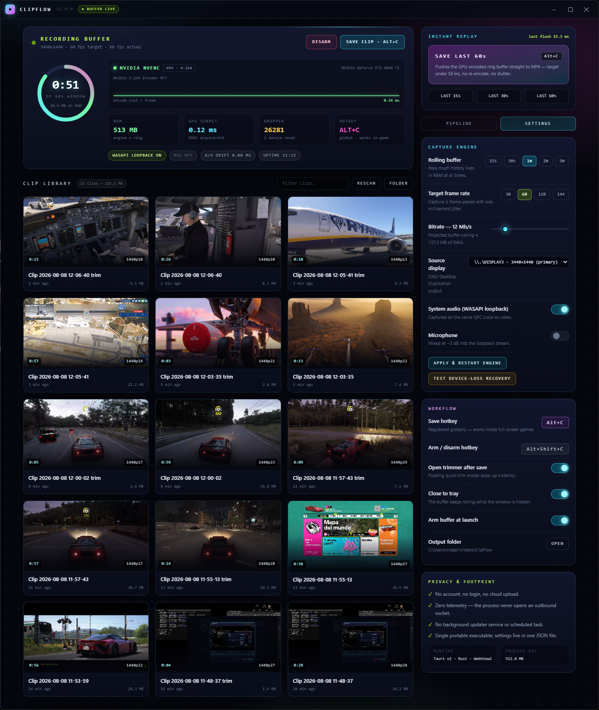

# ClipFlow

<p align="center">
  <strong>Ultra-Lightweight Instant Replay & Game Clipping Engine for Windows 10/11</strong>
</p>

<p align="center">
  <a href="https://buymeacoffee.com/jaimitus">
    
  </a>
  
  
  
</p>

---



---

## ⚡ Overview

**ClipFlow** is a zero-bloat, high-performance Instant Replay and Game Clipping desktop app for Windows 10 and 11. 

Designed for gamers and creators who demand maximum FPS and instant clipping without background resource hogging, ClipFlow continuously records your active display into a rolling memory buffer directly on your GPU. Pressing `Alt + C` instantly flushes your buffer to an MP4 video file in **under 50 milliseconds**.

> ### 🆕 What's new in **1.1.0**
> - ⌨️ **Custom hotkeys** — rebind `Alt+C` and `Alt+Shift+C` from Settings by clicking the badge and pressing a new combo (live, persisted, validated).
> - 🎞️ **HEVC (H.265) recording** — roughly **half the file size** at the same quality, still hardware-encoded.
> - 🖼️ **PNG snapshots** — grab any frame of a clip straight from the trimmer.
> - ✏️ **Rename clips** + ▶ **open in external player** + sort/filter/compact **gallery** + ✕ **clear library**.
> - 🔔 **Save sound**, 📌 **always-on-top** window, 📊 **flush latency stats** (last / avg / best) and a first-run **onboarding** overlay.
> - 🔄 **Signed auto-updates** via GitHub Releases — check from Settings and install in one click (or a silent probe at launch). No background updater, no telemetry.
>
> Full list in [CHANGELOG.md](CHANGELOG.md).

---

## ✨ Key Features

- **⚡ Sub-50ms Instant Clip Flush:** Snapshot your last 30–120 seconds of gameplay to `%USERPROFILE%\Videos\ClipFlow` in under 50 ms. Zero rendering queues or waiting.
- **⌨️ Fully Customisable Hotkeys:** Rebind save and arm/disarm from the UI — click, press, done. Persisted in one JSON file.
- **🎞️ H.264 or HEVC (H.265):** Pick your codec; HEVC cuts storage in half while staying fully hardware-accelerated.
- **🖥️ DXGI Desktop Duplication & Direct3D 11:** Zero-copy GPU surface acquisition at 60–144 FPS with sub-millisecond frame latency.
- **🎯 Native Hardware Encoding MFT:** Leverages Media Foundation hardware encoders (NVIDIA NVENC, AMD AMF, Intel QSV) for near-zero CPU usage.
- **🎙️ Synchronized WASAPI Audio Loopback:** Dual capture for system output audio and microphone, encoded to AAC-LC at 48 kHz stereo on a unified QPC clock.
- **✂️ Keyframe Stream-Copy Trimmer:** Trim your clips instantly without re-encoding, preserving 100% video quality with zero export delay.
- **🛡️ 100% Private & Zero Telemetry:** No user account, no login, no cloud upload, no telemetry sockets, and no background updater service. The only network call is a version probe against GitHub Releases (silent at launch, or on demand from Settings) — no analytics, no tracking.
- **🔄 Signed Auto-Updates via GitHub Releases:** Updates are delivered through the Releases page (`latest.json` + `.sig`), checked from Settings → About & Updates and installed in one click. You stay in control — no background updater.
- **💧 Ultra-Low Memory Footprint:** Keeps encoded packets in a circular RAM buffer (<100 MB RAM usage for 60 s history).
- **🔄 Resilient GPU Recovery:** Automatically detects resolution switches, UAC prompts, or driver TDR resets (`DXGI_ERROR_DEVICE_RESET`) and re-arms Desktop Duplication seamlessly.

---

## ⚔️ Why ClipFlow? (Feature Comparison)

ClipFlow was built to eliminate the bloat, mandatory accounts, and high RAM overhead common in modern clipping apps.

| Feature | ⚡ **ClipFlow** | NVIDIA ShadowPlay | Medal.tv | Outplayed / Overwolf | SteelSeries GG | OBS Replay Buffer |
| :--- | :---: | :---: | :---: | :---: | :---: | :---: |
| **Mandatory Account / Login** | ❌ **None (0%)** | ⚠️ Required | ⚠️ Required | ⚠️ Required | ⚠️ Required | ❌ None |
| **RAM Footprint** | ⚡ **< 100 MB** | 🟡 300–600 MB | 🔴 800 MB–1.5 GB | 🔴 1.0–2.0 GB | 🔴 700 MB–1.2 GB | 🟡 400–800 MB |
| **Telemetry / Tracking** | ❌ **Zero** | ⚠️ Yes | ⚠️ Yes | ⚠️ Yes | ⚠️ Yes | ❌ None |
| **Flush Latency (`Alt + C`)** | ⚡ **< 50 ms** | 🟡 ~500 ms | 🔴 2–5 seconds | 🔴 3–10 seconds | 🔴 2–5 seconds | 🟡 ~300 ms |
| **Lossless Stream-Copy Trim** | ✅ **Built-in** | ❌ Separate tool | 🟡 Re-encodes | 🟡 Re-encodes | 🟡 Re-encodes | ❌ None |
| **Single Portable Binary** | ✅ **Yes (.exe)** | ❌ GeForce Exp. | ❌ Heavy Installer | ❌ Overwolf App | ❌ Huge Suite | ❌ Installer |
| **Background Updater Service** | ❌ **None** | ⚠️ Yes | ⚠️ Yes | ⚠️ Yes | ⚠️ Yes | ❌ None |

---

## 🚀 Quick Start

### 1. Download & Run
Choose your preferred flavor from the [Releases](https://github.com/jaimitus/ClipFlow/releases) page:
- **Standalone Portable:** `ClipFlow_v1.1.0_Portable.exe` (Single executable, no installation needed)
- **Setup Installer:** `ClipFlow_1.1.0_x64-setup.exe` (NSIS Installer)
- **MSI Package:** `ClipFlow_1.1.0_x64_en-US.msi` (Windows Installer)

### 2. Basic Controls
- `Alt + C`: **Save Instant Replay** (Flushes your active rolling buffer to disk).
- `Alt + Shift + C`: **Arm / Disarm Buffer** (Toggles active GPU recording).
- Both hotkeys are **customisable** — Settings → click the badge → press your combo.
- **Updates:** Settings → About & Updates → `CHECK UPDATE` downloads and installs the newest signed release automatically.

Saved clips are stored in `%USERPROFILE%\Videos\ClipFlow`. PNG snapshots land in the same folder.

---

## 🛠️ Building from Source

### Prerequisites
- [Rust](https://www.rust-lang.org/tools/install) (1.75+)
- [Node.js](https://nodejs.org/) (v18+)
- C++ Build Tools for Visual Studio (Windows 10/11 SDK)

### Build Instructions

```powershell
# Clone repository
git clone https://github.com/jaimitus/ClipFlow.git
cd ClipFlow

# Install frontend dependencies
npm install

# Build frontend production assets
npm run build

# Build production binary & installers
npx @tauri-apps/cli build
```

The compiled binary and installers will be generated under `src-tauri/target/release/bundle/`.

---

## 📄 License

This project is licensed under the [MIT License](LICENSE).

---

<p align="center">
  Developed with ❤️ by <a href="https://github.com/jaimitus">jaimitus</a>. If you find ClipFlow useful, consider <a href="https://buymeacoffee.com/jaimitus">supporting the project</a>!
</p>
